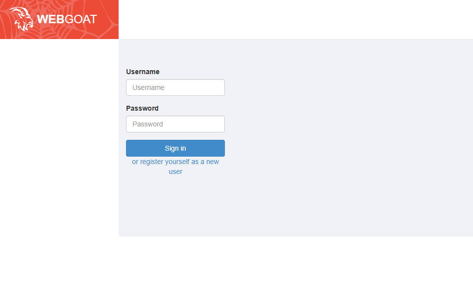
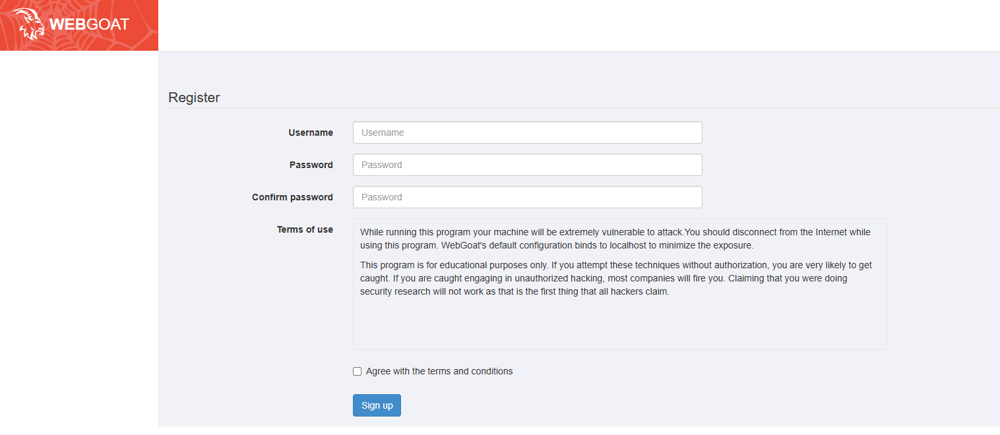

Getting started with <a href="https://hub.docker.com/r/webgoat/webgoat">webgoat</a> is rather easy. I am using Docker to run this application. The command is 

```bash
docker run -p 0.0.0.0:8080:8080 -p 0.0.0.0:9090:9090 -e TZ=America/New_York webgoat/webgoat
```

Once the image is pulled and the container is up and running you can visit `http://<IP-OF-HOST>:8080/WebGoat`, you'll be greeted by a sign on page.


Click to register a new user `or register yourself as a new user`.



You can start going through the lessons.