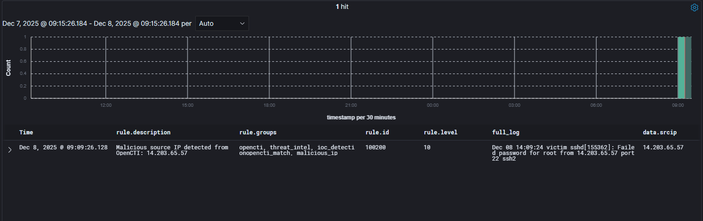
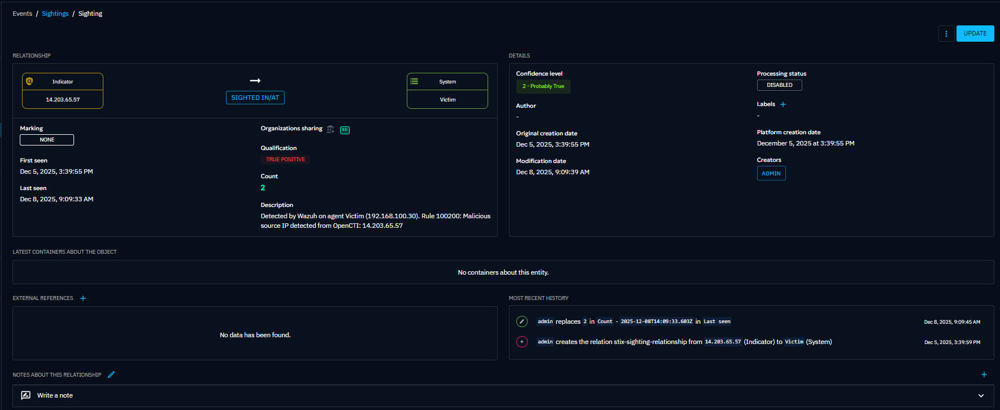

## Introduction

This guide walks you through integrating Wazuh, an open-source SIEM and XDR platform, with OpenCTI, a leading open-source threat intelligence platform. The result is a bidirectional integration that automatically detects indicators of compromise (IOCs) and enriches your security alerts with actionable threat context.

## Why This Integration Matters

**The Problem with Traditional Security Operations**

Security teams face several critical challenges:

**Alert Fatigue**: SOC analysts review thousands of alerts daily, most of which are benign. Without context, it's nearly impossible to identify real threats quickly.

**Intelligence Silos**: Threat intelligence platforms collect vast amounts of IOC data, but this information rarely makes it to the tools that need it most—your SIEM and detection systems.

**Manual Correlation**: Analysts waste precious time manually checking if observed IPs, domains, or file hashes are malicious, looking them up in VirusTotal, threat feeds, or internal databases.

**Delayed Response**: By the time threats are identified and correlated with intelligence, attackers may have already achieved their objectives.

### How Wazuh + OpenCTI Solves These Problems

This integration creates an automated threat intelligence pipeline:

1. **Proactive Detection**: OpenCTI's threat intelligence automatically feeds into Wazuh, enabling real-time detection of known malicious IPs, domains, file hashes, and URLs
2. **Automatic Enrichment**: When Wazuh detects an IOC, it queries OpenCTI for additional context—threat actor associations, campaign information, and confidence scores
3. **Bidirectional Intelligence**: Detection events in Wazuh create "sightings" in OpenCTI, showing where and when threats appear in your environment
4. **Contextual Alerting**: Security teams receive enriched alerts with full threat context, enabling faster, more informed responses

## Architecture Overview

The integration works in two complementary directions:

1. OpenCTI → Wazuh (Proactive Detection)

```text
OpenCTI Threat Intelligence
         ↓
   [Sync Script runs every 6 hours]
         ↓
   Wazuh CDB Lists (IOCs)
         ↓
   Detection Rules
         ↓
   Alerts when matches found
```

How it works: A Python script periodically pulls indicators from OpenCTI and creates CDB (Constant Database) lists that Wazuh uses for real-time log correlation. When any log entry matches an IOC, Wazuh immediately generates an alert.

2. Wazuh → OpenCTI (Enrichment & Sightings)

```text
Wazuh Alert Generated
         ↓
   [Integration Script]
         ↓
   Query OpenCTI for context
         ↓
   Create Sighting in OpenCTI
         ↓
   Return Enriched Alert
```

How it works: When Wazuh generates an alert (especially IOC matches), an integration script queries OpenCTI's API for additional context and creates a "sighting" record showing when and where the indicator was observed.

## Prerequisites
- Wazuh Manager installed and running
- OpenCTI instance accessible from Wazuh Manager
- OpenCTI API token with write permissions
- Python 3.6+ installed on Wazuh Manager

## Part 1: Setting Up OpenCTI to Wazuh IOC Feed

This component proactively feeds threat intelligence from OpenCTI into Wazuh for detection.

**Step 1: Install Dependencies: Install Python Dependencies** (I installed this on the system for testing my scripts)

```bash
pip3 install pycti requests
```

Install pycti so that Wazuh Manager can use the package

```bash
/var/ossec/framework/python/bin/python3 -m pip install pycti
```
**Step 2: Create the custom Integration**

Create a file `/var/ossec/integrations/custom-opencti`. All custom integrations must be prepended with `custom-*` for Wazuh.

```bash
vim /var/ossec/integrations/custom-opencti
```

Paste in the file contents:

```bash
#!/bin/sh
# Copyright (C) 2015, Wazuh Inc.
# Created by Wazuh, Inc. <info@wazuh.com>.
# This program is free software; you can redistribute it and/or modify it under the terms of GPLv2

WPYTHON_BIN="framework/python/bin/python3"

SCRIPT_PATH_NAME="$0"

DIR_NAME="$(cd $(dirname ${SCRIPT_PATH_NAME}); pwd -P)"
SCRIPT_NAME="$(basename ${SCRIPT_PATH_NAME})"

case ${DIR_NAME} in
    */active-response/bin | */wodles*)
        if [ -z "${WAZUH_PATH}" ]; then
            WAZUH_PATH="$(cd ${DIR_NAME}/../..; pwd)"
        fi

        PYTHON_SCRIPT="${DIR_NAME}/${SCRIPT_NAME}.py"
    ;;
    */bin)
        if [ -z "${WAZUH_PATH}" ]; then
            WAZUH_PATH="$(cd ${DIR_NAME}/..; pwd)"
        fi

        PYTHON_SCRIPT="${WAZUH_PATH}/framework/scripts/$(echo ${SCRIPT_NAME} | sed 's/\-/_/g').py"
    ;;
     */integrations)
        if [ -z "${WAZUH_PATH}" ]; then
            WAZUH_PATH="$(cd ${DIR_NAME}/..; pwd)"
        fi

        PYTHON_SCRIPT="${DIR_NAME}/${SCRIPT_NAME}.py"
    ;;
esac


${WAZUH_PATH}/${WPYTHON_BIN} ${PYTHON_SCRIPT} "$@"
```

Set the proper permissions

```bash
sudo chmod 750 /var/ossec/integrations/custom-opencti
sudo chown root:wazuh /var/ossec/integrations/opencti
```

**Step 3. Configure the Python script for the integration**

Create the `/var/ossec/integrations/custom-opencti.py` file

This script:

- Receives alerts from Wazuh
- Extracts IOCs (IPs, hashes, domains)
- Queries OpenCTI for matches
- Creates sightings in OpenCTI
- Returns enriched alerts

Paste in the contents

```python
#!/usr/bin/env python3
"""
Wazuh-OpenCTI Integration Script
Queries OpenCTI for IOC matches and creates sightings when found
Place in: /var/ossec/integrations/custom-opencti.py
"""

import sys
import json
import os
import logging
from datetime import datetime, timezone
from pycti import OpenCTIApiClient
from datetime import datetime, timezone

now = datetime.now(timezone.utc)
timestamp = now.isoformat(timespec='milliseconds').replace('+00:00', 'Z')

# Configuration
OPENCTI_URL = '<opencti ip or url>'
OPENCTI_TOKEN = '<opencti token>'
LOG_FILE = '/var/ossec/logs/opencti-integration.log'

# Setup logging
logging.basicConfig(
    filename=LOG_FILE,
    level=logging.INFO,
    format='%(asctime)s - %(levelname)s - %(message)s'
)

class WazuhOpenCTIIntegration:
    def __init__(self):
        """Initialize OpenCTI API client"""
        try:
            self.client = OpenCTIApiClient(OPENCTI_URL, OPENCTI_TOKEN)
            self.wazuh_identity_id = None  # Cache the identity ID
            logging.info("Successfully connected to OpenCTI")
        except Exception as e:
            logging.error(f"Failed to connect to OpenCTI: {e}")
            sys.exit(1)
    def get_or_create_agent_identity(self, agent_name, agent_ip):
        """
        Create or return a STIX Identity for the specific agent.
        """
        try:
            # Try to find existing identity by name
            identities = self.client.identity.list(
                filters={
                    "mode": "and",
                    "filters": [{
                        "key": ["name"],
                        "values": [agent_name],
                        "operator": "eq"
                    }],
                    "filterGroups": []
                }
            )
            if identities and len(identities) > 0:
                return identities[0]['id']

            # Create identity if not found
            identity = self.client.identity.create(
                type="System",
                name=agent_name,
                description=f"Wazuh Agent at {agent_ip}"
            )
            return identity['id']

        except Exception as e:
            logging.error(f"Error creating agent identity for {agent_name}: {e}")
            return None 

    def get_or_create_wazuh_identity(self):
        """Get or create a Wazuh identity to use as the sighting source"""
        # Return cached ID if we already have it
        if self.wazuh_identity_id:
            return self.wazuh_identity_id
            
        try:
            # Try to find existing Wazuh identity
            identities = self.client.identity.list(
                filters={
                    "mode": "and",
                    "filters": [{
                        "key": ["name"],
                        "values": ["Wazuh SIEM"],
                        "operator": "eq"
                    }],
                    "filterGroups": []
                }
            )
            
            if identities and len(identities) > 0:
                self.wazuh_identity_id = identities[0]['id']
                logging.info(f"Found existing Wazuh identity: {self.wazuh_identity_id}")
                return self.wazuh_identity_id
            
            # Create new identity if not found
            identity = self.client.identity.create(
                type="System",
                name="Wazuh SIEM",
                description="Wazuh Security Information and Event Management System"
            )
            
            self.wazuh_identity_id = identity['id']
            logging.info(f"Created Wazuh identity: {self.wazuh_identity_id}")
            return self.wazuh_identity_id
            
        except Exception as e:
            logging.error(f"Error getting/creating Wazuh identity: {e}")
            return None
    
    def extract_iocs(self, alert):
        """Extract potential IOCs from Wazuh alert"""
        iocs = {
            'ipv4': [],
            'ipv6': [],
            'domain': [],
            'url': [],
            'file_hash': []
        }
        
        data = alert.get('data', {})
        
        # Extract IPs
        if 'srcip' in data:
            iocs['ipv4'].append(data['srcip'])
        if 'dstip' in data:
            iocs['ipv4'].append(data['dstip'])
        
        # Extract file hashes
        for hash_type in ['md5', 'sha1', 'sha256']:
            if hash_type in data:
                iocs['file_hash'].append({
                    'type': hash_type,
                    'value': data[hash_type]
                })
        
        # Extract domains and URLs
        if 'url' in data:
            iocs['url'].append(data['url'])
        if 'domain' in data:
            iocs['domain'].append(data['domain'])
        if 'dns_query' in data:
            iocs['domain'].append(data['dns_query'])
        
        return iocs
    
    def search_indicator(self, ioc_type, ioc_value):
        """Search for indicator in OpenCTI"""
        try:
            # Build STIX pattern based on IOC type
            if ioc_type == 'ipv4':
                pattern = f"[ipv4-addr:value = '{ioc_value}']"
            elif ioc_type == 'ipv6':
                pattern = f"[ipv6-addr:value = '{ioc_value}']"
            elif ioc_type == 'domain':
                pattern = f"[domain-name:value = '{ioc_value}']"
            elif ioc_type == 'url':
                pattern = f"[url:value = '{ioc_value}']"
            elif ioc_type == 'file_hash':
                hash_type = ioc_value['type'].upper()
                pattern = f"[file:hashes.'{hash_type}' = '{ioc_value['value']}']"
                ioc_value = ioc_value['value']
            else:
                return None
            
            # Search for indicators matching the pattern
            indicators = self.client.indicator.list(
                filters={
                    "mode": "and",
                    "filters": [{
                        "key": ["pattern"],
                        "values": [pattern],
                        "operator": "eq"
                    }],
                    "filterGroups": []
                }
            )
            
            if indicators:
                logging.info(f"Found match for {ioc_type}: {ioc_value}")
                return indicators[0] if isinstance(indicators, list) else indicators
            
            return None
            
        except Exception as e:
            logging.error(f"Error searching for {ioc_type} {ioc_value}: {e}")
            return None
    
    def create_sighting(self, indicator_id, alert):
        """Create a sighting in OpenCTI"""
        try:
            # Get Wazuh identity to use as sighting source
            wazuh_identity_id = self.get_or_create_wazuh_identity()
            if not wazuh_identity_id:
                logging.error("Could not get Wazuh identity, cannot create sighting")
                return None
            
            # Extract relevant information from Wazuh alert
            agent_name = alert.get('agent', {}).get('name', 'Unknown')
            agent_ip = alert.get('agent', {}).get('ip', 'Unknown')
            rule_description = alert.get('rule', {}).get('description', 'Wazuh Alert')
            rule_id = alert.get('rule', {}).get('id', 'Unknown')
            #timestamp = alert.get('timestamp', datetime.now(timezone.utc))
            raw_ts = alert.get('timestamp')
            if raw_ts:
            # parse the alert timestamp, convert to UTC
                try:
                    dt = datetime.fromisoformat(raw_ts)
                    if dt.tzinfo is None:
                        dt = dt.replace(tzinfo=timezone.utc)
                    else:
                        dt = dt.astimezone(timezone.utc)
                except Exception:
                    dt = datetime.now(timezone.utc)
            else:
                dt = datetime.now(timezone.utc)

            timestamp_str = dt.isoformat(timespec='milliseconds').replace('+00:00', 'Z')

            # Create/get agent identity for this alert
            agent_identity_id = self.get_or_create_agent_identity(agent_name, agent_ip)
            
            # Create sighting description
            description = (
                f"Detected by Wazuh on agent {agent_name} ({agent_ip}). "
                f"Rule {rule_id}: {rule_description}"
            )
            
            # Create the sighting using stix_sighting_relationship
            sighting = self.client.stix_sighting_relationship.create(
                toId=agent_identity_id,  # The entity that saw the indicator (Wazuh)
                fromId=indicator_id,          # The indicator that was seen
                description=description,
                first_seen=timestamp_str,
                last_seen=timestamp_str,
                count=1,
                confidence=75
            )
            
            logging.info(f"Created sighting for indicator {indicator_id}")
            return sighting
            
        except Exception as e:
            logging.error(f"Error creating sighting: {e}")
            return None
    
    def generate_wazuh_alert(self, indicator, alert):
        """Generate enriched Wazuh alert with OpenCTI data"""
        try:
            # Safely extract labels
            labels = indicator.get('objectLabel', [])
            if labels and isinstance(labels, list):
                label_values = [label.get('value', '') for label in labels if isinstance(label, dict)]
            else:
                label_values = []
            
            # Safely extract created by
            created_by = indicator.get('createdBy', {})
            threat_actor = created_by.get('name', 'Unknown') if isinstance(created_by, dict) else 'Unknown'
            
            enriched_alert = {
                "opencti_match": True,
                "indicator_id": indicator.get('id'),
                "indicator_name": indicator.get('name'),
                "indicator_labels": label_values,
                "indicator_score": indicator.get('x_opencti_score', 0),
                "threat_actor": threat_actor,
                "original_alert": {
                    "rule_id": alert.get('rule', {}).get('id'),
                    "rule_description": alert.get('rule', {}).get('description'),
                    "agent_name": alert.get('agent', {}).get('name'),
                    "agent_ip": alert.get('agent', {}).get('ip')
                }
            }
            
            # Write enriched alert to stdout (Wazuh will capture this)
            print(json.dumps(enriched_alert))
            
            return enriched_alert
        except Exception as e:
            logging.error(f"Error generating enriched alert: {e}")
            return None
    
    def process_alert(self, alert):
        """Main processing function"""
        try:
            rule_id = alert.get('rule', {}).get('id', 'Unknown')
            logging.info(f"Processing alert: {rule_id}")
            
            # Extract IOCs from alert
            iocs = self.extract_iocs(alert)
            
            matches_found = False
            
            # Check each IOC type
            for ioc_type, ioc_list in iocs.items():
                for ioc_value in ioc_list:
                    if not ioc_value:
                        continue
                    
                    # Search in OpenCTI
                    indicator = self.search_indicator(ioc_type, ioc_value)
                    
                    if indicator:
                        matches_found = True
                        logging.info(f"Match found: {ioc_type} = {ioc_value}")
                        
                        # Create sighting
                        self.create_sighting(indicator['id'], alert)
                        
                        # Generate enriched alert
                        self.generate_wazuh_alert(indicator, alert)
            
            if not matches_found:
                logging.debug("No IOC matches found in OpenCTI")
            
            return matches_found
            
        except Exception as e:
            logging.error(f"Error processing alert: {e}")
            return False

def main():
    try:
        # args[1] is JSON alert file
        alert_file = sys.argv[1]

        with open(alert_file) as f:
            alert = json.load(f)

        integration = WazuhOpenCTIIntegration()
        integration.process_alert(alert)

    except Exception as e:
        logging.error(f"Fatal error: {e}")

if __name__ == "__main__":
    main()
```

> Make sure to change:
> `OPENCTI_URL = '<opencti ip or url>'`
> `OPENCTI_TOKEN = '<opencti token>'`
{: .prompt-info }

**Step 4. Configure Wazuh Integration**

Edit `/var/ossec/etc/ossec.conf` and add

This tells Wazuh where to look for the IOCs from OpenCTI and where the integration lives to send the alerts.

```xml
<ossec_config>
  <integration>
    <name>custom-opencti</name>
    <hook_url>IP or URL for OpenCTI</hook_url>
    <level>5</level>
    <alert_format>json</alert_format>
  </integration>
</ossec_config>

<ossec_config>
  <ruleset>
    <!-- OpenCTI CDB Lists -->
    <list>etc/lists/opencti-ipv4</list>
    <list>etc/lists/opencti-ipv6</list>
    <list>etc/lists/opencti-domain</list>
    <list>etc/lists/opencti-md5</list>
    <list>etc/lists/opencti-sha1</list>
    <list>etc/lists/opencti-sha256</list>
    
    <!-- Include OpenCTI rules -->
    <rule_dir>rules</rule_dir>
  </ruleset>
</ossec_config>
```

> Make sure to change:
> `<hook_url>IP or URL for OpenCTI</hook_url>`
{: .prompt-info }


**Step 5. Create Custom Wazuh Rules:**

Create `/var/ossec/etc/rules/opencti_rules.xml`

These are the rules that will fire when Wazuh sees any IOC from OpenCTI.

```xml
<group name="opencti,threat_intel">
  
  <!-- Rule for OpenCTI match detected -->
  <rule id="100100" level="12">
    <decoded_as>json</decoded_as>
    <field name="opencti_match">true</field>
    <description>Threat indicator detected - matched in OpenCTI threat intelligence</description>
    <group>opencti,threat_detection,</group>
  </rule>

  <!-- High severity indicator -->
  <rule id="100101" level="15">
    <if_sid>100100</if_sid>
    <field name="indicator_score" type="pcre2">^([8-9]\d|100)$</field>
    <description>HIGH severity threat indicator detected (score: $(indicator_score))</description>
    <group>opencti,critical_threat,</group>
  </rule>

  <!-- Known threat actor -->
  <rule id="100102" level="13">
    <if_sid>100100</if_sid>
    <field name="threat_actor" negate="yes">^Unknown$</field>
    <description>Threat indicator linked to known threat actor: $(threat_actor)</description>
    <group>opencti,apt,</group>
  </rule>

  <!-- IP-based IOC -->
  <rule id="100103" level="10">
    <if_sid>100100</if_sid>
    <field name="original_alert.data.srcip">\.+</field>
    <description>Malicious source IP detected: $(original_alert.data.srcip)</description>
    <group>opencti,network_threat,</group>
  </rule>

  <!-- File hash IOC -->
  <rule id="100104" level="12">
    <if_sid>100100</if_sid>
    <field name="original_alert.data.sha256">\.+</field>
    <description>Malicious file hash detected: $(original_alert.data.sha256)</description>
    <group>opencti,malware,</group>
  </rule>

</group>
```

**Step 6. Feed Sync Script**

This python script will pull IOCs from OpenCTI and import them into Wazuh

```bash
vim /usr/local/bin/opencti-wazuh-sync.py
```

Add the code:

```python
#!/usr/bin/env python3
"""
OpenCTI to Wazuh IOC Feed Synchronization
Pulls IOCs from OpenCTI and creates Wazuh CDB lists for detection
Run as a scheduled job (cron) to keep IOC lists updated
"""

import os
import sys
import json
import logging
from datetime import datetime, timedelta
from pycti import OpenCTIApiClient

# Configuration
OPENCTI_URL = 'URL or IP of OpenCTI' #Changeme
OPENCTI_TOKEN = 'OpenCTI Token' #Changeme
WAZUH_CDB_PATH = '/var/ossec/etc/lists'
LOG_FILE = '/var/ossec/logs/opencti-feed-sync.log'

# IOC age threshold (only pull recent IOCs)
IOC_MAX_AGE_DAYS = 180

# Minimum confidence score (0-100)
MIN_CONFIDENCE = 50

# Setup logging
logging.basicConfig(
    filename=LOG_FILE,
    level=logging.INFO,
    format='%(asctime)s - %(levelname)s - %(message)s'
)

class OpenCTIToWazuhSync:
    def __init__(self):
        """Initialize OpenCTI API client"""
        try:
            self.client = OpenCTIApiClient(OPENCTI_URL, OPENCTI_TOKEN)
            logging.info("Successfully connected to OpenCTI")
        except Exception as e:
            logging.error(f"Failed to connect to OpenCTI: {e}")
            sys.exit(1)
    
    def get_indicators(self, indicator_types=None, min_score=MIN_CONFIDENCE):
        """Fetch indicators from OpenCTI"""
        try:
            # Calculate date threshold - use timezone-aware datetime
            from datetime import timezone
            date_threshold = (datetime.now(timezone.utc) - timedelta(days=IOC_MAX_AGE_DAYS)).isoformat()
            
            # Build filters using newer FilterGroup format
            filter_list = [
                {
                    "key": ["created_at"],
                    "values": [date_threshold],
                    "operator": "gt",
                    "mode": "and"
                },
                {
                    "key": ["x_opencti_score"],
                    "values": [str(min_score)],
                    "operator": "gte",
                    "mode": "and"
                }
            ]
            
            if indicator_types:
                filter_list.append({
                    "key": ["pattern_type"],
                    "values": indicator_types,
                    "operator": "eq",
                    "mode": "and"
                })
            
            # Create FilterGroup structure
            filters = {
                "mode": "and",
                "filters": filter_list,
                "filterGroups": []
            }
            
            # Fetch indicators
            indicators = self.client.indicator.list(
                filters=filters,
                first=10000  # Adjust based on your needs
            )
            
            logging.info(f"Retrieved {len(indicators) if indicators else 0} indicators from OpenCTI")
            return indicators if indicators else []
            
        except Exception as e:
            logging.error(f"Error fetching indicators: {e}")
            return []
    
    def parse_stix_pattern(self, pattern):
        """Extract observable value from STIX pattern"""
        try:
            # Examples:
            # [ipv4-addr:value = '192.168.1.1']
            # [domain-name:value = 'evil.com']
            # [file:hashes.MD5 = 'abc123']
            
            if '=' in pattern:
                value = pattern.split('=')[1].strip()
                value = value.replace("'", "").replace('"', '').replace(']', '')
                return value.strip()
            return None
        except Exception as e:
            logging.warning(f"Failed to parse pattern: {pattern} - {e}")
            return None
    
    def categorize_indicators(self, indicators):
        """Categorize indicators by type"""
        categorized = {
            'ipv4': [],
            'ipv6': [],
            'domain': [],
            'url': [],
            'md5': [],
            'sha1': [],
            'sha256': []
        }
        
        for indicator in indicators:
            # Skip None or invalid indicators
            if not indicator or not isinstance(indicator, dict):
                logging.warning(f"Skipping invalid indicator: {indicator}")
                continue
            
            pattern = indicator.get('pattern', '')
            if not pattern:
                logging.debug(f"Skipping indicator without pattern: {indicator.get('id', 'unknown')}")
                continue
                
            value = self.parse_stix_pattern(pattern)
            
            if not value:
                logging.debug(f"Could not parse value from pattern: {pattern}")
                continue
            
            # Get metadata with safe defaults
            try:
                labels = indicator.get('objectLabel', [])
                if labels and isinstance(labels, list):
                    label_values = [label.get('value', '') for label in labels if isinstance(label, dict) and label.get('value')]
                else:
                    label_values = []
                
                created_by = indicator.get('createdBy', {})
                threat_actor = created_by.get('name', 'Unknown') if isinstance(created_by, dict) else 'Unknown'
                
                metadata = {
                    'value': value,
                    'name': indicator.get('name', 'Unknown'),
                    'description': indicator.get('description', '')[:200],  # Limit description length
                    'score': indicator.get('x_opencti_score', 0),
                    'labels': label_values,
                    'created': indicator.get('created', ''),
                    'threat_actor': threat_actor
                }
            except Exception as e:
                logging.warning(f"Error extracting metadata for indicator {indicator.get('id', 'unknown')}: {e}")
                continue
            
            # Categorize by pattern type
            try:
                if 'ipv4-addr' in pattern:
                    categorized['ipv4'].append(metadata)
                elif 'ipv6-addr' in pattern:
                    categorized['ipv6'].append(metadata)
                elif 'domain-name' in pattern:
                    categorized['domain'].append(metadata)
                elif 'url' in pattern:
                    categorized['url'].append(metadata)
                elif 'MD5' in pattern:
                    categorized['md5'].append(metadata)
                elif 'SHA-1' in pattern or 'SHA1' in pattern:
                    categorized['sha1'].append(metadata)
                elif 'SHA-256' in pattern or 'SHA256' in pattern:
                    categorized['sha256'].append(metadata)
                else:
                    logging.debug(f"Unknown pattern type: {pattern}")
            except Exception as e:
                logging.warning(f"Error categorizing indicator: {e}")
                continue
        
        return categorized
    
    def create_cdb_list(self, ioc_type, iocs):
        """Create Wazuh CDB list file"""
        try:
            # Create both the source file (without .cdb) and let Wazuh compile it
            filename = f"opencti-{ioc_type}"
            filepath = os.path.join(WAZUH_CDB_PATH, filename)
            
            with open(filepath, 'w') as f:
                for ioc in iocs:
                    # CDB format: key:value
                    # Keep value simple - Wazuh has limits on CDB value size
                    # Format: IOC:threat_actor|score|labels
                    labels = ','.join(ioc['labels'][:2]) if ioc['labels'] else ''  # Max 2 labels
                    metadata = f"{ioc['threat_actor']}|{ioc['score']}|{labels}"
                    f.write(f"{ioc['value']}:{metadata}\n")
            
            logging.info(f"Created CDB list: {filename} with {len(iocs)} entries")
            return filepath
            
        except Exception as e:
            logging.error(f"Error creating CDB list for {ioc_type}: {e}")
            return None
    
    def create_wazuh_rules(self):
        """Create Wazuh rules for IOC detection"""
        rules_file = os.path.join(WAZUH_CDB_PATH, '../rules/opencti_ioc_rules.xml')
        
        rules_content = '''<!--
  OpenCTI IOC Detection Rules
  Auto-generated by OpenCTI feed sync
-->

<group name="opencti,threat_intel,ioc_detection">

  <!-- Malicious IP detected (source) -->
  <rule id="100200" level="10">
    <if_group>firewall|web|authentication</if_group>
    <list field="srcip" lookup="address_match_key">etc/lists/opencti-ipv4</list>
    <description>Malicious source IP detected from OpenCTI: $(srcip)</description>
    <mitre>
      <id>TA0001</id>
    </mitre>
    <group>opencti_match,malicious_ip,</group>
  </rule>

  <!-- Malicious IP detected (destination) -->
  <rule id="100201" level="10">
    <if_group>firewall|web|ids</if_group>
    <list field="dstip" lookup="address_match_key">etc/lists/opencti-ipv4</list>
    <description>Connection to malicious IP from OpenCTI: $(dstip)</description>
    <mitre>
      <id>TA0011</id>
    </mitre>
    <group>opencti_match,c2_communication,</group>
  </rule>

  <!-- Malicious domain detected (DNS query) -->
  <rule id="100202" level="12">
    <if_group>dns</if_group>
    <list field="dns.question.name" lookup="match_key">etc/lists/opencti-domain</list>
    <description>DNS query to malicious domain from OpenCTI: $(dns.question.name)</description>
    <mitre>
      <id>TA0011</id>
    </mitre>
    <group>opencti_match,malicious_domain,</group>
  </rule>

  <!-- Malicious domain detected (HTTP host) -->
  <rule id="100203" level="12">
    <if_group>web|proxy</if_group>
    <list field="url" lookup="match_key_value">etc/lists/opencti-domain</list>
    <description>HTTP request to malicious domain from OpenCTI: $(url)</description>
    <mitre>
      <id>TA0011</id>
    </mitre>
    <group>opencti_match,malicious_domain,</group>
  </rule>

  <!-- Malicious file hash detected (MD5) -->
  <rule id="100204" level="15">
    <if_group>syscheck</if_group>
    <list field="md5_after" lookup="match_key">etc/lists/opencti-md5</list>
    <description>Malicious file detected (MD5) from OpenCTI: $(md5_after)</description>
    <mitre>
      <id>TA0002</id>
    </mitre>
    <group>opencti_match,malware,</group>
  </rule>

  <!-- Malicious file hash detected (SHA1) -->
  <rule id="100205" level="15">
    <if_group>syscheck</if_group>
    <list field="sha1_after" lookup="match_key">etc/lists/opencti-sha1</list>
    <description>Malicious file detected (SHA1) from OpenCTI: $(sha1_after)</description>
    <mitre>
      <id>TA0002</id>
    </mitre>
    <group>opencti_match,malware,</group>
  </rule>

  <!-- Malicious file hash detected (SHA256) -->
  <rule id="100206" level="15">
    <if_group>syscheck</if_group>
    <list field="sha256_after" lookup="match_key">etc/lists/opencti-sha256</list>
    <description>Malicious file detected (SHA256) from OpenCTI: $(sha256_after)</description>
    <mitre>
      <id>TA0002</id>
    </mitre>
    <group>opencti_match,malware,</group>
  </rule>

  <!-- High confidence indicator -->
  <rule id="100207" level="13">
    <if_sid>100200,100201,100202,100203,100204,100205,100206</if_sid>
    <match>\\|8|\\|9|\\|10</match>
    <description>HIGH confidence threat indicator detected from OpenCTI (score 80+)</description>
    <group>high_confidence,critical_threat,</group>
  </rule>

  <!-- APT-related indicator -->
  <rule id="100208" level="14">
    <if_sid>100200,100201,100202,100203,100204,100205,100206</if_sid>
    <match>apt|APT|threat-actor</match>
    <description>APT-related indicator detected from OpenCTI</description>
    <group>apt,advanced_threat,</group>
  </rule>

</group>
'''
        
        try:
            with open(rules_file, 'w') as f:
                f.write(rules_content)
            logging.info(f"Created Wazuh rules file: {rules_file}")
            return rules_file
        except Exception as e:
            logging.error(f"Error creating rules file: {e}")
            return None
    
    def update_ossec_conf(self):
        """Generate ossec.conf snippet for CDB lists"""
        config_snippet = '''
<!-- OpenCTI IOC Lists Configuration -->
<!-- Add this to your /var/ossec/etc/ossec.conf -->

<ossec_config>
  <ruleset>
    <!-- OpenCTI CDB Lists -->
    <list>etc/lists/opencti-ipv4</list>
    <list>etc/lists/opencti-ipv6</list>
    <list>etc/lists/opencti-domain</list>
    <list>etc/lists/opencti-url</list>
    <list>etc/lists/opencti-md5</list>
    <list>etc/lists/opencti-sha1</list>
    <list>etc/lists/opencti-sha256</list>
    
    <!-- OpenCTI Rules -->
    <rule_dir>rules</rule_dir>
  </ruleset>
</ossec_config>
'''
        
        snippet_file = os.path.join(WAZUH_CDB_PATH, 'opencti_ossec_config.txt')
        try:
            with open(snippet_file, 'w') as f:
                f.write(config_snippet)
            logging.info(f"Created ossec.conf snippet: {snippet_file}")
            print(f"\n[INFO] Configuration snippet created at: {snippet_file}")
            print("[INFO] Add the contents to your /var/ossec/etc/ossec.conf")
        except Exception as e:
            logging.error(f"Error creating config snippet: {e}")
    
    def sync(self):
        """Main synchronization function"""
        logging.info("Starting OpenCTI to Wazuh IOC synchronization")
        print("\n[*] Starting OpenCTI IOC feed synchronization...")
        
        try:
            # Fetch indicators from OpenCTI
            print("[*] Fetching indicators from OpenCTI...")
            indicators = self.get_indicators()
            
            if not indicators:
                logging.warning("No indicators retrieved from OpenCTI")
                print("[!] No indicators found. Check your OpenCTI instance.")
                return
            
            # Categorize indicators
            print(f"[*] Processing {len(indicators)} indicators...")
            categorized = self.categorize_indicators(indicators)
            
            # Create CDB lists
            print("[*] Creating Wazuh CDB lists...")
            files_created = []
            for ioc_type, iocs in categorized.items():
                if iocs:
                    filepath = self.create_cdb_list(ioc_type, iocs)
                    if filepath:
                        files_created.append(filepath)
                        print(f"  ✓ {ioc_type}: {len(iocs)} IOCs → {filepath}")
                else:
                    # Create empty file to prevent Wazuh errors (without .cdb extension)
                    filepath = os.path.join(WAZUH_CDB_PATH, f"opencti-{ioc_type}")
                    with open(filepath, 'w') as f:
                        f.write("# Empty - no IOCs of this type\n")
                    print(f"  - {ioc_type}: 0 IOCs (empty file created)")
            
            # Create rules
            print("[*] Creating Wazuh detection rules...")
            rules_file = self.create_wazuh_rules()
            if rules_file:
                print(f"  ✓ Rules created: {rules_file}")
            
            # Generate config snippet
            self.update_ossec_conf()
            
            # Summary
            total_iocs = sum(len(iocs) for iocs in categorized.values())
            logging.info(f"Synchronization complete. Total IOCs: {total_iocs}")
            print(f"\n[✓] Synchronization complete!")
            print(f"[✓] Total IOCs synchronized: {total_iocs}")
            print(f"[✓] CDB files created: {len(files_created)}")
            print("\n[NEXT STEPS]")
            print("1. Review the CDB lists in: /var/ossec/etc/lists/")
            print("2. Review the rules in: /var/ossec/etc/rules/opencti_ioc_rules.xml")
            print("3. Add the configuration from: /var/ossec/etc/lists/opencti_ossec_config.txt")
            print("4. Restart Wazuh: sudo systemctl restart wazuh-manager")
            print("5. Set up a cron job to run this script periodically")
            
        except Exception as e:
            logging.error(f"Error during sync: {e}", exc_info=True)
            print(f"\n[ERROR] Sync failed: {e}")
            print("Check log for details: /var/ossec/logs/opencti-feed-sync.log")
            raise

def main():
    """Main entry point"""
    try:
        sync = OpenCTIToWazuhSync()
        sync.sync()
    except Exception as e:
        logging.error(f"Synchronization failed: {e}")
        print(f"\n[ERROR] Synchronization failed: {e}")
        sys.exit(1)

if __name__ == "__main__":
    main() 
```


>Make sure to change:
>
>```python
>OPENCTI_URL = 'URL or IP of OpenCTI' #Changeme
>OPENCTI_TOKEN = 'OpenCTI Token' #Changeme
>```
{: .prompt-info }

Make the script executable:

```bash
chmod +x /usr/local/bin/opencti-wazuh-sync.py
```

Run initial sync:

```bash
/usr/local/bin/opencti-wazuh-sync.py
```

This creates:
- `/var/ossec/etc/lists/opencti-*` - IOC lists
- `/var/ossec/etc/rules/opencti_ioc_rules.xml` - Detection rules
- `/var/ossec/etc/lists/opencti_ossec_config.txt` - Config snippet

**Step 7. Set up automated Sync**

Create cron job for regular updates:

```bash
sudo crontab -e
```

Add (sync every 6 hours):

```cron
0 */6 * * * /usr/local/bin/opencti-wazuh-sync.py >> /var/log/opencti-sync.log 2>&1
```

**Step 8. Configure Integration in Wazuh**

Create Enrichment Rules `/var/ossec/etc/rules/opencti_enrichment_rules.xml`

```xml
<group name="opencti,enrichment">

  <!-- Enriched alert with OpenCTI match -->
  <rule id="100300" level="12">
    <decoded_as>json</decoded_as>
    <field name="opencti_match">true</field>
    <description>Alert enriched with OpenCTI threat intelligence</description>
    <group>opencti_enriched,</group>
  </rule>

  <!-- High severity from both sources -->
  <rule id="100301" level="15">
    <if_sid>100300</if_sid>
    <field name="indicator_score" type="pcre2">^([8-9]\d|100)$</field>
    <description>CRITICAL: High severity IOC confirmed by OpenCTI (score: $(indicator_score))</description>
    <group>critical,double_confirmed,</group>
  </rule>

</group>
```

**Step 9. Restart Wazuh**

```bash
sudo systemctl restart wazuh-manager
```

## Testing the integration

This is a script to test out if the integrations work. On the Wazuh manager find some of the IOCs that have been pulled in:

```bash
tail /var/ossec/etc/lists/opencti-ipv4
```

Now on a system that has a Wazuh agent installed, create a script:

```bash
#!/bin/bash
# opencti-wazuh-test.sh - Run on Wazuh agent

echo "[*] Testing Wazuh-OpenCTI Integration"

# Get hostname
HOST=$(hostname)

# Test SSH from suspicious IP
echo "[+] Test : Simulating SSH login attempt"
logger -p auth.info -t sshd 'Failed password for root from <malicious IP> port 22 ssh2'

echo "[✓] Test complete. Check Wazuh alerts in 10-30 seconds"
echo "    On manager: tail -f /var/ossec/logs/alerts/alerts.json"
```

> Make sure to change the IP to one from the `opencti-ipv4` list
{: .prompt-info }

After running the script, here is the alert in Wazuh:



And here is the Sighting in OpenCTI:



## Conclusion

Integrating Wazuh with OpenCTI transforms both platforms from independent tools into a cohesive threat intelligence and detection ecosystem. Your SIEM becomes proactive, automatically identifying threats based on global intelligence, while your threat intelligence platform gains visibility into real-world attack patterns in your environment.