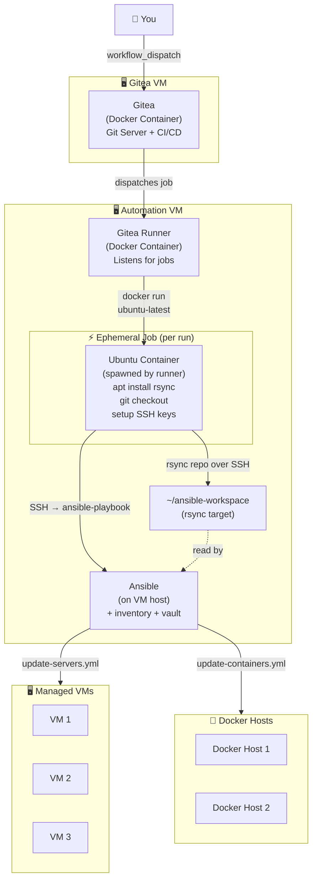
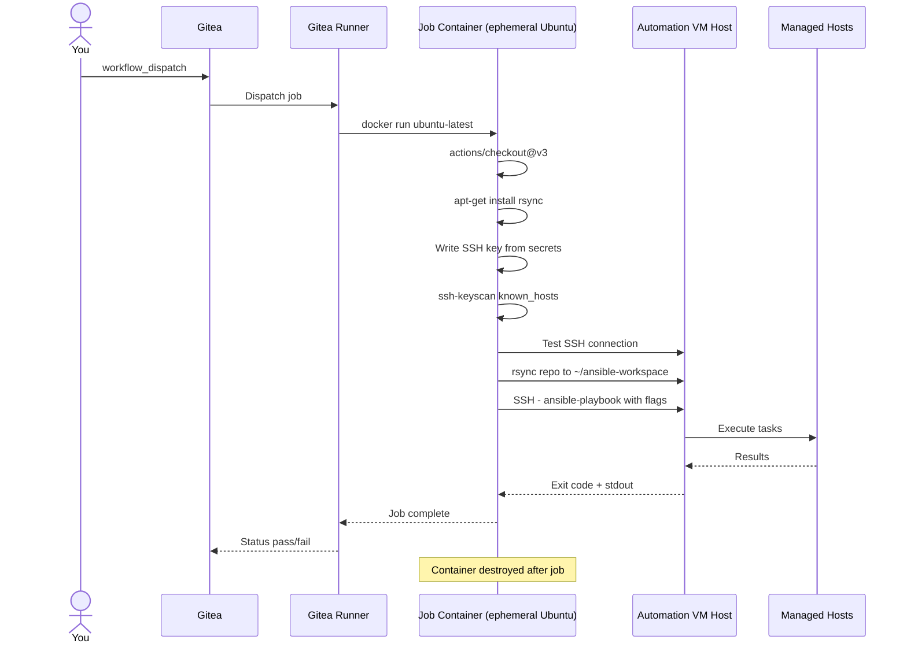

# Automating Homelab Updates with Gitea Actions and Ansible

Managing a homelab is a rewarding hobby, with lots to learn, until update day rolls around. Manually SSHing into each VM, running `apt upgrade`, pulling new Docker images, and cleaning up old containers gets old fast.

At the same time, I’ve been looking to deepen my understanding of CI/CD and how it can be applied to security workflows, especially in areas like detection engineering and automated response. I figured I could accomplish both with the same project.

In this post, I’ll walk through how I combined those goals by automating my homelab updates using Gitea Actions, a self-hosted runner, and Ansible.

---

## Architecture Overview

Before diving into the config, here's how everything fits together:



### Components

| Component | Where It Lives | Role |
|-----------|---------------|------|
| **Gitea** | Docker container on Gitea VM | Git hosting + CI/CD orchestration |
| **Gitea Runner** | Docker container on Automation VM | Listens for jobs from Gitea, spawns job containers via Docker |
| **Job Container** | Ephemeral Ubuntu container, spun up on the Automation VM host per job | Installs rsync, checks out the repo, configures SSH, syncs playbooks to the VM host, then delegates to Ansible over SSH |
| **Ansible** | Installed directly on the Automation VM host | Runs playbooks against managed hosts; holds inventory, SSH keys, and vault |
| **Managed VMs** | Various | Receive `apt` updates |
| **Docker Hosts** | Various | Receive container image updates |

---

## How It Works

The workflow is split into two Gitea Actions pipelines: one for **VM updates** and one for **container updates**. Both follow the same pattern:



Each job runs inside a **fresh Ubuntu container** that the runner spins up on the Automation VM's Docker host. This container handles all the setup work: installing rsync, writing the SSH key from secrets, checking out the repo. Then hands the job off to Ansible on the VM host over SSH. Once the job finishes, the container is destroyed. Ansible itself lives on the host, outside the container, where it has persistent access to your inventory and SSH keys.

---

## Installing Gitea

I'm using docker compose so the installation is very easy. Here is my compose file:

```yaml
networks:
  gitea:
    external: false

services:
  server:
    image: gitea/gitea:latest
    container_name: gitea
    environment:
      - USER_UID=1000
      - USER_GID=1000
    restart: always
    networks:
      - gitea
    volumes:
      - ./gitea:/data
      - /home/git/.ssh/:/data/git/.ssh
      - /etc/timezone:/etc/timezone:ro
      - /etc/localtime:/etc/localtime:ro
    ports:
      - "3000:3000"
      - "2222:22"
```

---

## Configure Gitea

Once the container is up and running, go to `<gitea IP>:3000` and you'll be greeted by an Initial Configuration page. You can keep the settings default if you'd like, or put your specific configurations. Then hit `Install Gitea`.

Once that finishes, you can Register your admin account and you're done. You can create a repository to host your files.

#### Creating Repo

Create a new repo and name it something that makes sense to you. 

Now that the repo is created you can create the following files

The full repo structure looks like this:

```
.
├── .gitea/
│   └── workflows/
│       ├── update-servers.yml
│       └── update-containers.yml
└── playbooks/
    ├── update-servers.yml
    ├── update-containers.yml
    └── inventory/
        ├── hosts.ini     # For VM updates
        └── hosts.yml     # For container updates
```

---

## Workflow: Updating VMs

The `update-servers` workflow triggers manually via `workflow_dispatch`. You can target specific hosts, run in dry-run mode, or filter by tags all from the Gitea UI.

```yaml
name: Run Ansible Playbooks

on:
  workflow_dispatch:
    inputs:
      playbook:
        description: 'Playbook to run (path relative to repo root)'
        required: true
        default: 'playbooks/update-servers.yml'
      inventory:
        description: 'Inventory file to use'
        required: false
        default: 'playbooks/inventory/hosts.ini'
      limit:
        description: 'Limit to specific hosts (optional)'
        required: false
        default: ''
      tags:
        description: 'Run specific tags (optional)'
        required: false
        default: ''
      check_mode:
        description: 'Run in check mode (dry-run)'
        required: false
        default: 'false'

jobs:
  ansible:
    runs-on: ubuntu-latest
    steps:
      - name: Checkout repository
        uses: actions/checkout@v3
      
      - name: Setup SSH for automation server
        run: |
          mkdir -p ~/.ssh
          chmod 700 ~/.ssh
          echo "${{ secrets.ANSIBLE_SSH_KEY }}" > ~/.ssh/id_rsa
          chmod 600 ~/.ssh/id_rsa
          ssh-keyscan -H ${{ secrets.ANSIBLE_SERVER }} >> ~/.ssh/known_hosts
          chmod 644 ~/.ssh/known_hosts
      
      - name: Test SSH connection
        run: |
          ssh -o StrictHostKeyChecking=no ${{ secrets.ANSIBLE_USER }}@${{ secrets.ANSIBLE_SERVER }} \
            "echo 'SSH connection successful'"

      - name: Install rsync
        run: apt-get update && apt-get install -y rsync
      
      - name: Sync repository to automation server
        run: |
          ssh ${{ secrets.ANSIBLE_USER }}@${{ secrets.ANSIBLE_SERVER }} \
            "mkdir -p ~/ansible-workspace"
          rsync -avz --delete \
            -e "ssh -o StrictHostKeyChecking=no" \
            ./ ${{ secrets.ANSIBLE_USER }}@${{ secrets.ANSIBLE_SERVER }}:~/ansible-workspace/
      
      - name: Run Ansible playbook
        run: |
          PLAYBOOK="${{ github.event.inputs.playbook || 'playbooks/update-servers.yml' }}"
          INVENTORY="${{ github.event.inputs.inventory || 'playbooks/inventory/hosts.ini' }}"
          LIMIT="${{ github.event.inputs.limit }}"
          TAGS="${{ github.event.inputs.tags }}"
          CHECK_MODE="${{ github.event.inputs.check_mode }}"
          
          CMD="cd ~/ansible-workspace && ansible-playbook $PLAYBOOK -i $INVENTORY -v"
          
          if [ "$CHECK_MODE" = "true" ]; then CMD="$CMD --check"; fi
          if [ -n "$LIMIT" ]; then CMD="$CMD --limit $LIMIT"; fi
          if [ -n "$TAGS" ]; then CMD="$CMD --tags $TAGS"; fi
          
          ssh ${{ secrets.ANSIBLE_USER }}@${{ secrets.ANSIBLE_SERVER }} "$CMD"
```

### Required Secrets

Set these in your Gitea repository under **Settings → Actions → Secrets**:

| Secret | Value |
|--------|-------|
| `ANSIBLE_SSH_KEY` | Private SSH key for the Automation VM |
| `ANSIBLE_SERVER` | Hostname or IP of the Automation VM |
| `ANSIBLE_USER` | SSH user on the Automation VM |

---

## Workflow: Updating Containers

The container update workflow is nearly identical in structure, same SSH delegation pattern, different default playbook and inventory file.

```yaml
name: Run Ansible Playbooks

on:
  workflow_dispatch:
    inputs:
      playbook:
        description: 'Playbook to run (path relative to repo root)'
        required: true
        default: 'playbooks/update-containers.yml'
      inventory:
        description: 'Inventory file to use'
        required: false
        default: 'playbooks/inventory/hosts.yml'
      limit:
        description: 'Limit to specific hosts (optional)'
        required: false
        default: ''
      tags:
        description: 'Run specific tags (optional)'
        required: false
        default: ''
      check_mode:
        description: 'Run in check mode (dry-run)'
        required: false
        default: 'false'

jobs:
  ansible:
    runs-on: ubuntu-latest
    steps:
      - name: Checkout repository
        uses: actions/checkout@v3
      
      - name: Setup SSH for automation server
        run: |
          mkdir -p ~/.ssh
          chmod 700 ~/.ssh
          echo "${{ secrets.ANSIBLE_SSH_KEY }}" > ~/.ssh/id_rsa
          chmod 600 ~/.ssh/id_rsa
          ssh-keyscan -H ${{ secrets.ANSIBLE_SERVER }} >> ~/.ssh/known_hosts
          chmod 644 ~/.ssh/known_hosts
      
      - name: Test SSH connection
        run: |
          ssh -o StrictHostKeyChecking=no ${{ secrets.ANSIBLE_USER }}@${{ secrets.ANSIBLE_SERVER }} \
            "echo 'SSH connection successful'"
        
      - name: Install rsync
        run: apt-get update && apt-get install -y rsync
     
      - name: Sync repository to automation server
        run: |
          ssh ${{ secrets.ANSIBLE_USER }}@${{ secrets.ANSIBLE_SERVER }} \
            "mkdir -p ~/ansible-workspace"
          rsync -avz --delete \
            -e "ssh -o StrictHostKeyChecking=no" \
            ./ ${{ secrets.ANSIBLE_USER }}@${{ secrets.ANSIBLE_SERVER }}:~/ansible-workspace/
      
      - name: Run Ansible playbook
        run: |
          PLAYBOOK="${{ github.event.inputs.playbook || 'playbooks/update-containers.yml' }}"
          INVENTORY="${{ github.event.inputs.inventory || 'playbooks/inventory/hosts.yml' }}"
          LIMIT="${{ github.event.inputs.limit }}"
          TAGS="${{ github.event.inputs.tags }}"
          CHECK_MODE="${{ github.event.inputs.check_mode }}"
          
          CMD="cd ~/ansible-workspace && ansible-playbook $PLAYBOOK -i $INVENTORY -v"
          
          if [ "$CHECK_MODE" = "true" ]; then CMD="$CMD --check"; fi
          if [ -n "$LIMIT" ]; then CMD="$CMD --limit $LIMIT"; fi
          if [ -n "$TAGS" ]; then CMD="$CMD --tags $TAGS"; fi
          
          ssh ${{ secrets.ANSIBLE_USER }}@${{ secrets.ANSIBLE_SERVER }} "$CMD"
```

---

## Ansible Playbook: Update Servers

This playbook runs a full `dist-upgrade` across all Ubuntu VMs and reports whether a reboot is needed, without actually rebooting automatically (a deliberate choice for a homelab).

```yaml
---
- name: Update Ubuntu Servers
  hosts: all
  become: true
  gather_facts: true
  ignore_unreachable: true
  
  tasks:   
    - name: Update apt cache
      apt:
        update_cache: yes
        cache_valid_time: 3600
    
    - name: Upgrade all packages to latest version
      apt:
        upgrade: dist
        autoremove: true
        autoclean: true
      register: apt_upgrade
    
    - name: Display upgrade summary
      debug:
        msg: "{{ apt_upgrade.stdout_lines | default(['No packages upgraded']) }}"
    
    - name: Check if reboot is required
      stat:
        path: /var/run/reboot-required
      register: reboot_required_file
    
    - name: Display reboot requirement
      debug:
        msg: "⚠️  REBOOT REQUIRED on {{ inventory_hostname }}"
      when: reboot_required_file.stat.exists
    
    - name: Display no reboot message
      debug:
        msg: "✓ No reboot required on {{ inventory_hostname }}"
      when: not reboot_required_file.stat.exists
```

A few things worth noting here:

- `ignore_unreachable: true` — if a VM is powered off, the playbook keeps going rather than failing the entire run.
- `cache_valid_time: 3600` — skips re-fetching the apt cache if it was refreshed in the last hour.
- The reboot check reads `/var/run/reboot-required`. If it exists, the job output flags it so you know to schedule a manual reboot at your convenience.

---

## Ansible Playbook: Update Containers

This playbook iterates over a list of Docker Compose projects defined in the host inventory, pulls fresh images, recreates containers, and then cleans up dangling images and volumes.

```yaml
---
- name: Update Docker Compose containers
  hosts: docker_hosts
  ignore_unreachable: true
  become: true

  tasks:
    - name: Update Docker Compose applications
      community.docker.docker_compose_v2:
        project_src: "{{ item.path }}"
        state: present
        pull: always
        recreate: always
        remove_orphans: yes
      loop: "{{ docker_apps }}"
      
    - name: Prune unused Docker images
      community.docker.docker_prune:
        images: yes
        images_filters:
          dangling: false

    - name: Prune unused Docker volumes
      community.docker.docker_prune:
        volumes: yes
```

The `docker_apps` variable is defined per host in your inventory, something like:

```yaml
# inventory/hosts.yml
docker_hosts:
  hosts:
    docker-host-1:
      ansible_host: 192.168.1.10
      docker_apps:
        - path: /opt/stacks/gitea
        - path: /opt/stacks/monitoring
        - path: /opt/stacks/media
    docker-host-2:
      ansible_host: 192.168.1.11
      docker_apps:
        - path: /opt/stacks/files
```

> `path` is the path to your `docker-compose.yml` files
{: .prompt-info }

The `pull: always` + `recreate: always` combination ensures you're never left running stale images after an update. Combined with `remove_orphans: yes`, this keeps your Compose environments clean.

> **Note:** This uses `community.docker.docker_compose_v2`, which requires the `docker` Python SDK and Compose V2 (`docker compose` rather than `docker-compose`). Install the collection with `ansible-galaxy collection install community.docker`.
{: .prompt-info }

---

## Runner

I run my runner on my host that also has ansible. Make sure docker is installed on the host. Here is the docker compose file:

```yaml
services:
  runner:
    image: docker.io/gitea/act_runner:latest
    environment:
      CONFIG_FILE: /config.yaml
      GITEA_INSTANCE_URL: "${INSTANCE_URL}"
      GITEA_RUNNER_REGISTRATION_TOKEN: "${REGISTRATION_TOKEN}"
      GITEA_RUNNER_NAME: "${RUNNER_NAME}"
      GITEA_RUNNER_LABELS: "${RUNNER_LABELS}"
    volumes:
      - ./config.yaml:/config.yaml
      - ./data:/data
      - /var/run/docker.sock:/var/run/docker.sock
```

To get the registration token, in Gitea go to "**Site Administration → Actions → Runners**". Create a new runner and it will give you the Registration token, copy that and put it in the docker compose file above.

---

## Webhook

Now to trigger the updates. First you need an Authorization token to authenticate to the Gitea server. To get a token go to **Users → Settings → Applications**, under Manage Access Tokens generate a new token. Give it a token name and "Read and Write" permissions on repository, then click `Generate Token`.


Now you can run this from your computer to update servers:

```bash
curl -X POST "https://<gitea_IP_or_URL>.com/api/v1/repos/<owner>/<repo>/actions/workflows/update.yml/dispatches" \
  -H "Authorization: token <token>" \
  -H "Content-Type: application/json" \
  -d '{
    "ref": "main",
    "inputs": {
      "playbook": "playbooks/update-servers.yml",
      "inventory": "playbooks/inventory/hosts.ini",
      "limit": "",
      "tags": "",
      "check_mode": "false"
    }
  },
```

> Make sure to update `<gitea_IP_or_URL>`, `<owner>`, `<repo>`, and `<token>`.
{: .prompt-info }

Run this to update containers:

```bash
curl -X POST "https://<gitea_IP_or_URL>.com/api/v1/repos/<owner>/<repo>/actions/workflows/containers.yml/dispatches" \
  -H "Authorization: token <token>" \
  -H "Content-Type: application/json" \
  -d '{
    "ref": "main",
    "inputs": {
      "playbook": "playbooks/update-containers.yml",
      "inventory": "playbooks/inventory/hosts.yml",
      "limit": "",
      "tags": "",
      "check_mode": "false"
    }
  }'
```

> Make sure to update `<gitea_IP_or_URL>`, `<owner>`, `<repo>`, and `<token>`.
{: .prompt-info }

## Tips and Gotchas

**Use `check_mode` before you run for real.** Both workflows expose a `check_mode` input. Set it to `true` for a dry run — Ansible will report what it *would* do without making changes. Great for sanity-checking before a big batch of updates.

**`ignore_unreachable: true` is your friend.** If you have VMs that aren't always on (test boxes, NAS that spins down, etc.), this prevents one offline host from blocking the entire playbook.

**The job container is ephemeral — Ansible is not.** For each run, the Gitea runner spawns a fresh Ubuntu container on the Automation VM's Docker host. That container installs rsync, writes the SSH key from secrets, and syncs the repo — then immediately delegates to Ansible running on the VM host over SSH. When the job ends, the container is gone. Ansible and your inventory live persistently on the host, completely separate from the container lifecycle.

**Keep your SSH key in Gitea Secrets, not the repo.** The `ANSIBLE_SSH_KEY` secret is written to `~/.ssh/id_rsa` at runtime and never committed anywhere.

---

## What's Next

A few things I'm considering adding to this setup:

- **Notifications** — pipe job results to a self-hosted ntfy or Gotify instance so you get a push notification when updates complete.
- **Reboot automation** — add an optional `reboot` tag to the server playbook that actually reboots hosts when required, with a configurable delay.
- **Rollback hooks** — for containers, snapshot the Compose project state before pulling so you can roll back on a bad image.


That's the full setup. A few YAML files, a runner, and you've turned a tedious manual process into a one-click (or scheduled) operation from your Gitea dashboard.